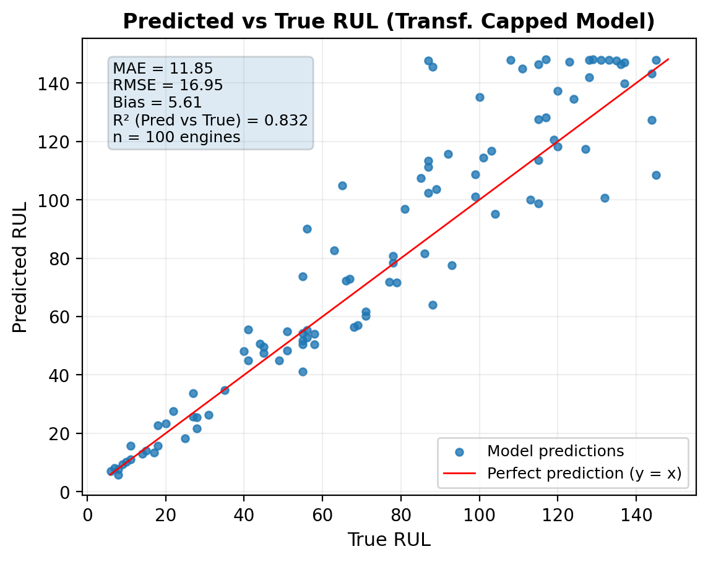
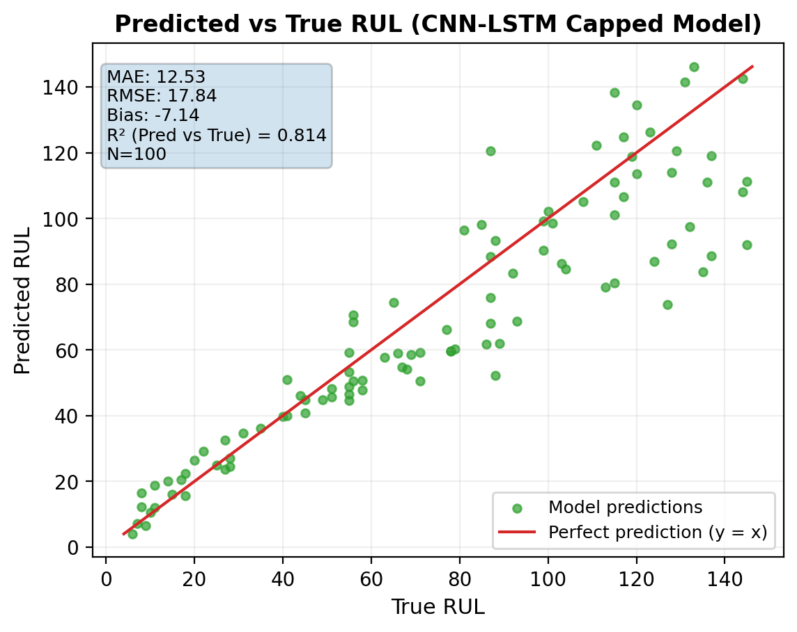
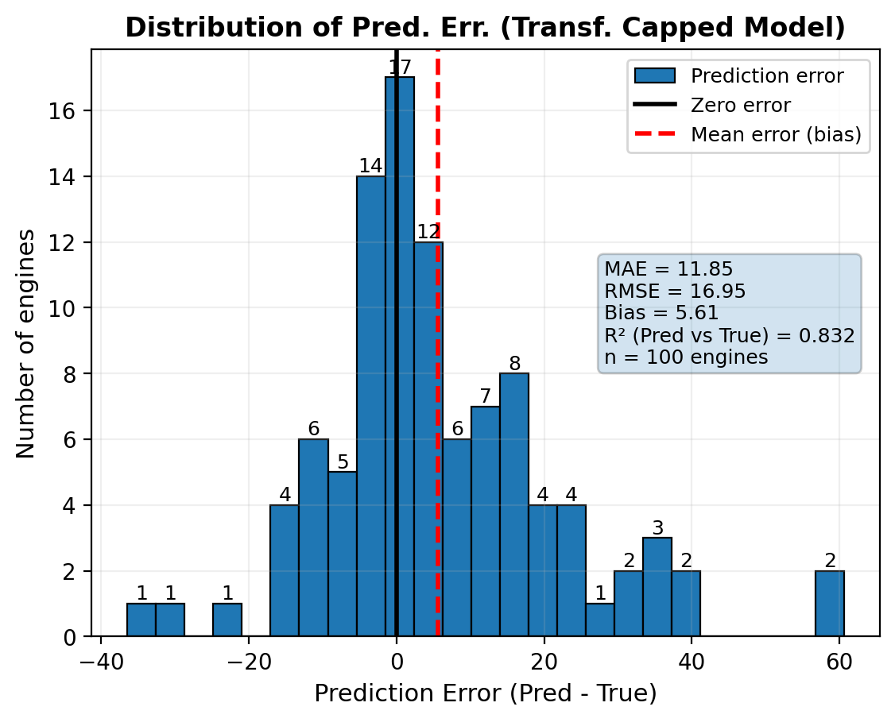
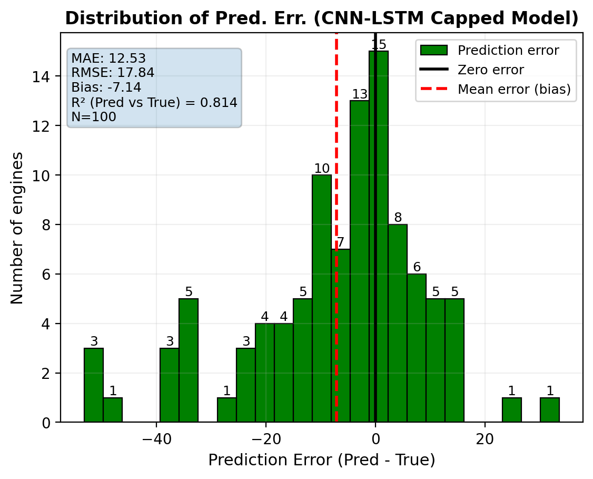

# RUL Prediction of Turbofan Engines

This project predicts the Remaining Useful Life (RUL) of aircraft turbofan engines — built for the Intelligent Systems course. It uses NASA's C-MAPSS **FD003** dataset (multiple operating conditions, two fault modes) and compares two deep learning architectures, a Transformer encoder and a CNN-LSTM hybrid, on how well they estimate the number of operating cycles an engine has left before failure.

## What this is about

Each engine in the dataset runs from a healthy state to failure while 21 sensors and 3 operational settings get logged every cycle. The task is to look at a rolling window of recent sensor readings and predict how many cycles are left before that engine fails. This is the core idea behind predictive maintenance: fix or replace a part before it breaks, instead of on a fixed schedule or after it already has.

Two labeling strategies were tested for every model:

- **Capped RUL** — RUL values are clipped at 150 cycles. An engine that's far from failure looks basically the same from sensor data alone, so capping is a common simplification in RUL work.
- **Uncapped RUL** — the raw RUL values are used, no ceiling.

## Pipeline

The scripts in `src/` are meant to run in order:

1. **`1-load_and_eda.py`** — loads `train_FD003.csv`, `test_FD003.csv`, and `RUL_FD003.csv`, checks engine counts and cycle ranges, and plots a few example sensor traces.
2. **`2-make_rul.py`** — computes ground-truth RUL for training data as `max_cycle_per_engine - current_cycle`, then looks at the RUL distribution.
3. **`3-prepare_data.py`** — picks out the sensor/setting columns, drops the ones that are nearly constant (std ≤ 1e-3), and standardizes features using mean/std computed only on the training set. Outputs `train_FD003_processed.csv` and `test_FD003_processed.csv`.
4. **`4-build_sequences.py`** — builds fixed-length sliding windows (50 cycles) per engine, splits engines 80/20 into train/validation, and saves the resulting tensors as `.npy` files.
5. **`5-transformer_model_{capped,uncapped}.py`** and **`5.2-CNN_LSTM_model_{capped,uncapped}.py`** — train the two architectures with early stopping on validation loss. Both use a weighted MSE loss that puts more weight on samples closer to failure (low RUL), since that's the region that actually matters for maintenance decisions.
6. **`6-test_plot_transf._{capped,uncapped}.py`** and **`6.2-test_plot_cnn_lstm_{capped,uncapped}.py`** — evaluate the trained models on the FD003 test set (last window per engine), compute error metrics, and save per-engine predictions, the 10 worst-predicted engines, and diagnostic plots.

## Models

**Transformer** — sensor/setting features get linearly projected to `d_model`, combined with a learned positional embedding, then passed through a `TransformerEncoder` (1 layer, 4 attention heads). The output is mean-pooled and fed through a regression head to produce a single RUL value per window.

**CNN-LSTM** — a 1D convolutional layer picks up local temporal patterns across the sequence, followed by a multi-layer LSTM that handles the longer-range dependencies, ending in a regression head.

Both share the same setup otherwise: sequence length 50, weighted MSE loss (weight increases as true RUL approaches 0, capped at 2x), Adam optimizer, and early stopping with a patience of 8 epochs.

## Results (FD003 test set, 100 engines)

| Model | RUL strategy | MAE (cycles) | RMSE (cycles) |
|---|---|---|---|
| Transformer | Capped @150 | 11.85 | 16.95 |
| CNN-LSTM | Capped @150 | 12.53 | 17.84 |
| Transformer | Uncapped | 16.20 | 23.97 |
| CNN-LSTM | Uncapped | 16.04 | 24.28 |

Capping RUL at 150 cycles helped both architectures — it removes the ambiguity of predicting an exact RUL far from failure, where the sensor signals barely change from one engine to the next. In the capped setting the Transformer edges out the CNN-LSTM; in the uncapped setting they're close, with the CNN-LSTM slightly ahead on MAE and the Transformer slightly ahead on RMSE.

### Predicted vs. true RUL

Transformer (capped) | CNN-LSTM (capped)
:---:|:---:
 | 

Points near the diagonal are accurate predictions. Both models track the trend reasonably well, with more scatter (and mostly under-prediction) as true RUL gets larger — which makes sense, since sensor data far from failure carries less signal.

### Error distribution

Transformer (capped) | CNN-LSTM (capped)
:---:|:---:
 | 

More plots — absolute error vs. true RUL, and the CDF of absolute error — are in `plots/Transformer/` and `plots/CNN-LSTM/` for all four model/strategy combinations.

## Repository structure

```
src/        Numbered pipeline scripts (EDA -> RUL labeling -> preprocessing -> sequencing -> training -> evaluation)
models/     Trained model weights (.pt) for all four model/strategy combinations
results/    Per-engine test predictions, worst-10 error cases, and feature scaler stats
plots/      Evaluation plots per model
```

## Data

The C-MAPSS FD003 dataset (train/test CSVs and RUL labels) isn't included in this repo — it's publicly available from the [NASA Prognostics Data Repository](https://www.nasa.gov/intelligent-systems-division/discovery-and-systems-health/pcoe/pcoe-data-set-repository/). The scripts expect the raw files (`train_FD003.csv`, `test_FD003.csv`, `RUL_FD003.csv`) in a `Data/` folder at the project root.

## Running it

Requires Python 3.9+ with `pandas`, `numpy`, `torch`, and `matplotlib`. GPU is not required — the training scripts default to Apple's MPS backend if available and fall back to CUDA otherwise, but will run on CPU with a small code change if neither is present.

```bash
pip install pandas numpy torch matplotlib

# place train_FD003.csv, test_FD003.csv, RUL_FD003.csv in Data/, then:
python src/1-load_and_eda.py
python src/2-make_rul.py
python src/3-prepare_data.py
python src/4-build_sequences.py
python src/5-transformer_model_capped.py       # or _uncapped
python "src/5.2-CNN_LSTM_model_capped.py"      # or _uncapped
python "src/6-test_plot_transf._capped.py"     # or _uncapped
python "src/6.2-test_plot_cnn_lstm_capped.py"  # or _uncapped
```

Trained weights for all four combinations are already included in `models/`, so you can skip straight to the evaluation scripts (step 6) if you just want to reproduce the plots and metrics.

## Author

Omar — Intelligent Systems, Masters coursework.
